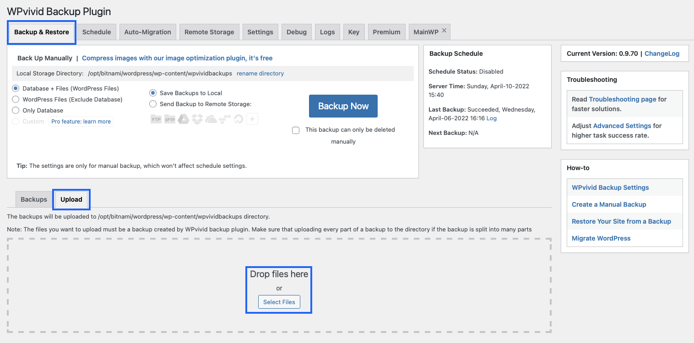

# Importing to Wordpress
A site backup has been provided through the use of WPvivid Backup, a plugin designed to allow for easy backup, restoration, and migration of WordPress sites.

## Migrating
The entirety of the deployed site can be migrated from the backup file. Ensure WPvivid Backup is installed and navigate to the plugin page.

Select *Backup & Restore* tab, then *Upload* tab, and either drag and drop the provided file, or *select* the file from your computer.

